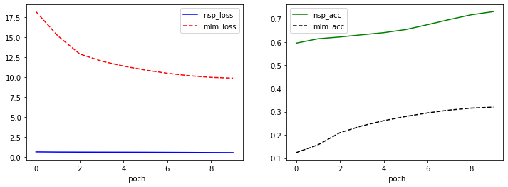

# mini BERT 만들기

vocab size를 8000으로 줄이고, 전체 파라미터 사이즈가 1M 정도가 되는 아주 작은 mini BERT 모델을 만들어 10 Epoch까지 학습시킨 모델을 만들어 보자.

## 1. 모듈 import


```python
from __future__ import absolute_import, division, print_function, unicode_literals

import os   #디렉토리 관리
import re   #정규식
import json   #파일
import math   #수치 연산
import random   #난수
import numpy as np   #행렬 연산
import matplotlib.pyplot as plt   #데이터 시각화
from tqdm.notebook import tqdm   #과정 출력
import os

import sentencepiece as spm   #토크나이저
import tensorflow as tf   #신경망
import tensorflow.keras.backend as K   #신경망

random_seed = 1234
random.seed(random_seed)
np.random.seed(random_seed)
tf.random.set_seed(random_seed)
```


```python
corpus_file = os.getenv('HOME')+'/aiffel/bert_pretrain/data/kowiki.txt'
prefix = 'ko_8000'
vocab_size = 8000
```


```python
f = open(corpus_file, 'r')
lines = f.readlines()

print("=" * 100)
for idx, line in enumerate(lines):
    print(line.strip(), end="\n\n")
    if idx == 5: break;
f.close()
print("=" * 100)
print(f"Line Num: {len(lines):,}")
```

    ====================================================================================================
    지미 카터
    
    제임스 얼 "지미" 카터 주니어(, 1924년 10월 1일 ~ )는 민주당 출신 미국 39번째 대통령 (1977년 ~ 1981년)이다.
    
    지미 카터는 조지아주 섬터 카운티 플레인스 마을에서 태어났다. 조지아 공과대학교를 졸업하였다. 그 후 해군에 들어가 전함·원자력·잠수함의 승무원으로 일하였다. 1953년 미국 해군 대위로 예편하였고 이후 땅콩·면화 등을 가꿔 많은 돈을 벌었다. 그의 별명이 "땅콩 농부" (Peanut Farmer)로 알려졌다.
    
    1962년 조지아 주 상원 의원 선거에서 낙선하나 그 선거가 부정선거 였음을 입증하게 되어 당선되고, 1966년 조지아 주 지사 선거에 낙선하지만 1970년 조지아 주 지사를 역임했다. 대통령이 되기 전 조지아주 상원의원을 두번 연임했으며, 1971년부터 1975년까지 조지아 지사로 근무했다. 조지아 주지사로 지내면서, 미국에 사는 흑인 등용법을 내세웠다.
    
    1976년 대통령 선거에 민주당 후보로 출마하여 도덕주의 정책으로 내세워, 포드를 누르고 당선되었다.
    
    카터 대통령은 에너지 개발을 촉구했으나 공화당의 반대로 무산되었다.
    
    ====================================================================================================
    Line Num: 3,957,761


## 2. Tokenizer 준비

### SentencePiece 모델 생성

단어사전 크기는 특수토큰을 포함하여 8,007개(7개의 특수 토큰 포함)


```python
spm.SentencePieceTrainer.train(
    f"--input={corpus_file} --model_prefix={prefix} --vocab_size={vocab_size + 7}" + 
    " --model_type=bpe" +
    " --max_sentence_length=999999" + # 문장 최대 길이
    " --pad_id=0 --pad_piece=[PAD]" + # pad (0)
    " --unk_id=1 --unk_piece=[UNK]" + # unknown (1)
    " --bos_id=2 --bos_piece=[BOS]" + # begin of sequence (2)
    " --eos_id=3 --eos_piece=[EOS]" + # end of sequence (3)
    " --user_defined_symbols=[SEP],[CLS],[MASK]") # 사용자 정의 토큰
```

    sentencepiece_trainer.cc(177) LOG(INFO) Running command: --input=/aiffel/aiffel/bert_pretrain/data/kowiki.txt --model_prefix=ko_8000 --vocab_size=8007 --model_type=bpe --max_sentence_length=999999 --pad_id=0 --pad_piece=[PAD] --unk_id=1 --unk_piece=[UNK] --bos_id=2 --bos_piece=[BOS] --eos_id=3 --eos_piece=[EOS] --user_defined_symbols=[SEP],[CLS],[MASK]
    sentencepiece_trainer.cc(77) LOG(INFO) Starts training with : 
    trainer_spec {
      input: /aiffel/aiffel/bert_pretrain/data/kowiki.txt
      input_format: 
      model_prefix: ko_8000
      model_type: BPE
      vocab_size: 8007
      self_test_sample_size: 0
      character_coverage: 0.9995
      input_sentence_size: 0
      shuffle_input_sentence: 1
      seed_sentencepiece_size: 1000000
      shrinking_factor: 0.75
      max_sentence_length: 999999
      num_threads: 16
      num_sub_iterations: 2
      max_sentencepiece_length: 16
      split_by_unicode_script: 1
      split_by_number: 1
      split_by_whitespace: 1
      split_digits: 0
      treat_whitespace_as_suffix: 0
      allow_whitespace_only_pieces: 0
      user_defined_symbols: [SEP]
      user_defined_symbols: [CLS]
      user_defined_symbols: [MASK]
      required_chars: 
      byte_fallback: 0
      vocabulary_output_piece_score: 1
      train_extremely_large_corpus: 0
      hard_vocab_limit: 1
      use_all_vocab: 0
      unk_id: 1
      bos_id: 2
      eos_id: 3
      pad_id: 0
      unk_piece: [UNK]
      bos_piece: [BOS]
      eos_piece: [EOS]
      pad_piece: [PAD]
      unk_surface:  ⁇ 
    }
    normalizer_spec {
      name: nmt_nfkc
      add_dummy_prefix: 1
      remove_extra_whitespaces: 1
      escape_whitespaces: 1
      normalization_rule_tsv: 
    }
    denormalizer_spec {}
    trainer_interface.cc(329) LOG(INFO) SentenceIterator is not specified. Using MultiFileSentenceIterator.
    trainer_interface.cc(178) LOG(INFO) Loading corpus: /aiffel/aiffel/bert_pretrain/data/kowiki.txt
    trainer_interface.cc(140) LOG(INFO) Loaded 1000000 lines
    trainer_interface.cc(140) LOG(INFO) Loaded 2000000 lines
    trainer_interface.cc(117) LOG(WARNING) Too many sentences are loaded! (2451287), which may slow down training.
    trainer_interface.cc(119) LOG(WARNING) Consider using --input_sentence_size=<size> and --shuffle_input_sentence=true.
    trainer_interface.cc(122) LOG(WARNING) They allow to randomly sample <size> sentences from the entire corpus.
    trainer_interface.cc(385) LOG(INFO) Loaded all 2451287 sentences
    trainer_interface.cc(400) LOG(INFO) Adding meta_piece: [PAD]
    trainer_interface.cc(400) LOG(INFO) Adding meta_piece: [UNK]
    trainer_interface.cc(400) LOG(INFO) Adding meta_piece: [BOS]
    trainer_interface.cc(400) LOG(INFO) Adding meta_piece: [EOS]
    trainer_interface.cc(400) LOG(INFO) Adding meta_piece: [SEP]
    trainer_interface.cc(400) LOG(INFO) Adding meta_piece: [CLS]
    trainer_interface.cc(400) LOG(INFO) Adding meta_piece: [MASK]
    trainer_interface.cc(405) LOG(INFO) Normalizing sentences...
    trainer_interface.cc(466) LOG(INFO) all chars count=287452241
    trainer_interface.cc(477) LOG(INFO) Done: 99.95% characters are covered.
    trainer_interface.cc(487) LOG(INFO) Alphabet size=4411
    trainer_interface.cc(488) LOG(INFO) Final character coverage=0.9995
    trainer_interface.cc(520) LOG(INFO) Done! preprocessed 2450254 sentences.
    trainer_interface.cc(526) LOG(INFO) Tokenizing input sentences with whitespace: 2450254
    trainer_interface.cc(537) LOG(INFO) Done! 7050692
    bpe_model_trainer.cc(167) LOG(INFO) Updating active symbols. max_freq=1781571 min_freq=424
    bpe_model_trainer.cc(258) LOG(INFO) Added: freq=576838 size=20 all=581927 active=38577 piece=▁아
    bpe_model_trainer.cc(258) LOG(INFO) Added: freq=390836 size=40 all=591445 active=48095 piece=▁유
    bpe_model_trainer.cc(258) LOG(INFO) Added: freq=297873 size=60 all=601378 active=58028 piece=에는
    bpe_model_trainer.cc(258) LOG(INFO) Added: freq=244712 size=80 all=609974 active=66624 piece=▁성
    bpe_model_trainer.cc(258) LOG(INFO) Added: freq=194372 size=100 all=616449 active=73099 piece=까지
    bpe_model_trainer.cc(167) LOG(INFO) Updating active symbols. max_freq=193674 min_freq=462
    bpe_model_trainer.cc(258) LOG(INFO) Added: freq=176838 size=120 all=625299 active=38770 piece=▁우
    bpe_model_trainer.cc(258) LOG(INFO) Added: freq=154294 size=140 all=632274 active=45745 piece=▁파
    bpe_model_trainer.cc(258) LOG(INFO) Added: freq=140625 size=160 all=639734 active=53205 piece=00
    bpe_model_trainer.cc(258) LOG(INFO) Added: freq=125983 size=180 all=645481 active=58952 piece=▁요
    bpe_model_trainer.cc(258) LOG(INFO) Added: freq=114855 size=200 all=649839 active=63310 piece=리아
    bpe_model_trainer.cc(167) LOG(INFO) Updating active symbols. max_freq=114086 min_freq=457
    bpe_model_trainer.cc(258) LOG(INFO) Added: freq=106760 size=220 all=657338 active=39316 piece=▁같은
    bpe_model_trainer.cc(258) LOG(INFO) Added: freq=100770 size=240 all=662564 active=44542 piece=▁왕
    bpe_model_trainer.cc(258) LOG(INFO) Added: freq=96037 size=260 all=670536 active=52514 piece=▁목
    bpe_model_trainer.cc(258) LOG(INFO) Added: freq=88392 size=280 all=675441 active=57419 piece=▁f
    bpe_model_trainer.cc(258) LOG(INFO) Added: freq=81678 size=300 all=681701 active=63679 piece=▁선수
    bpe_model_trainer.cc(167) LOG(INFO) Updating active symbols. max_freq=80870 min_freq=446
    bpe_model_trainer.cc(258) LOG(INFO) Added: freq=77144 size=320 all=686930 active=39163 piece=▁때문에
    bpe_model_trainer.cc(258) LOG(INFO) Added: freq=73218 size=340 all=691000 active=43233 piece=▁조선
    bpe_model_trainer.cc(258) LOG(INFO) Added: freq=68829 size=360 all=695717 active=47950 piece=▁천
    bpe_model_trainer.cc(258) LOG(INFO) Added: freq=64009 size=380 all=700839 active=53072 piece=▁196
    bpe_model_trainer.cc(258) LOG(INFO) Added: freq=60953 size=400 all=706675 active=58908 piece=▁돌
    bpe_model_trainer.cc(167) LOG(INFO) Updating active symbols. max_freq=60762 min_freq=435
    bpe_model_trainer.cc(258) LOG(INFO) Added: freq=58542 size=420 all=711350 active=39712 piece=▁다시
    bpe_model_trainer.cc(258) LOG(INFO) Added: freq=55779 size=440 all=715377 active=43739 piece=▁K
    bpe_model_trainer.cc(258) LOG(INFO) Added: freq=52528 size=460 all=721839 active=50201 piece=▁모두
    bpe_model_trainer.cc(258) LOG(INFO) Added: freq=49784 size=480 all=727356 active=55718 piece=▁히
    bpe_model_trainer.cc(258) LOG(INFO) Added: freq=47637 size=500 all=733038 active=61400 piece=▁전쟁
    bpe_model_trainer.cc(167) LOG(INFO) Updating active symbols. max_freq=47558 min_freq=423
    bpe_model_trainer.cc(258) LOG(INFO) Added: freq=45919 size=520 all=738287 active=41703 piece=▁있어
    bpe_model_trainer.cc(258) LOG(INFO) Added: freq=44025 size=540 all=743886 active=47302 piece=▁중심
    bpe_model_trainer.cc(258) LOG(INFO) Added: freq=42378 size=560 all=748357 active=51773 piece=▁N
    bpe_model_trainer.cc(258) LOG(INFO) Added: freq=40922 size=580 all=752114 active=55530 piece=▁H
    bpe_model_trainer.cc(258) LOG(INFO) Added: freq=39922 size=600 all=755142 active=58558 piece=le
    bpe_model_trainer.cc(167) LOG(INFO) Updating active symbols. max_freq=39768 min_freq=414
    bpe_model_trainer.cc(258) LOG(INFO) Added: freq=38924 size=620 all=761204 active=43650 piece=▁검
    bpe_model_trainer.cc(258) LOG(INFO) Added: freq=37771 size=640 all=767376 active=49822 piece=란드
    bpe_model_trainer.cc(258) LOG(INFO) Added: freq=36292 size=660 all=772837 active=55283 piece=정을
    bpe_model_trainer.cc(258) LOG(INFO) Added: freq=35134 size=680 all=778715 active=61161 piece=▁설립
    bpe_model_trainer.cc(258) LOG(INFO) Added: freq=34016 size=700 all=783719 active=66165 piece=▁역사
    bpe_model_trainer.cc(167) LOG(INFO) Updating active symbols. max_freq=34003 min_freq=400
    bpe_model_trainer.cc(258) LOG(INFO) Added: freq=33144 size=720 all=787243 active=42507 piece=▁만들어
    bpe_model_trainer.cc(258) LOG(INFO) Added: freq=32383 size=740 all=791538 active=46802 piece=▁시간
    bpe_model_trainer.cc(258) LOG(INFO) Added: freq=31645 size=760 all=795131 active=50395 piece=▁측
    bpe_model_trainer.cc(258) LOG(INFO) Added: freq=30941 size=780 all=798845 active=54109 piece=과의
    bpe_model_trainer.cc(258) LOG(INFO) Added: freq=30041 size=800 all=803050 active=58314 piece=도는
    bpe_model_trainer.cc(167) LOG(INFO) Updating active symbols. max_freq=30023 min_freq=392
    bpe_model_trainer.cc(258) LOG(INFO) Added: freq=29448 size=820 all=808546 active=45099 piece=▁난
    bpe_model_trainer.cc(258) LOG(INFO) Added: freq=28836 size=840 all=813895 active=50448 piece=▁21
    bpe_model_trainer.cc(258) LOG(INFO) Added: freq=28270 size=860 all=818654 active=55207 piece=▁찾
    bpe_model_trainer.cc(258) LOG(INFO) Added: freq=27299 size=880 all=824625 active=61177 piece=되지
    bpe_model_trainer.cc(258) LOG(INFO) Added: freq=26862 size=900 all=828285 active=64837 piece=하자
    bpe_model_trainer.cc(167) LOG(INFO) Updating active symbols. max_freq=26833 min_freq=381
    bpe_model_trainer.cc(258) LOG(INFO) Added: freq=26060 size=920 all=832595 active=45199 piece=부에
    bpe_model_trainer.cc(258) LOG(INFO) Added: freq=25504 size=940 all=838824 active=51428 piece=수의
    bpe_model_trainer.cc(258) LOG(INFO) Added: freq=24726 size=960 all=843322 active=55926 piece=▁남아
    bpe_model_trainer.cc(258) LOG(INFO) Added: freq=24083 size=980 all=848416 active=61020 piece=▁않는다
    bpe_model_trainer.cc(258) LOG(INFO) Added: freq=23647 size=1000 all=853601 active=66205 piece=인민
    bpe_model_trainer.cc(167) LOG(INFO) Updating active symbols. max_freq=23602 min_freq=368
    bpe_model_trainer.cc(258) LOG(INFO) Added: freq=23176 size=1020 all=859529 active=48367 piece=▁마지
    bpe_model_trainer.cc(258) LOG(INFO) Added: freq=22849 size=1040 all=863129 active=51967 piece=▁시리즈
    bpe_model_trainer.cc(258) LOG(INFO) Added: freq=22293 size=1060 all=868678 active=57516 piece=제로
    bpe_model_trainer.cc(258) LOG(INFO) Added: freq=21851 size=1080 all=873075 active=61913 piece=시의
    bpe_model_trainer.cc(258) LOG(INFO) Added: freq=21377 size=1100 all=878277 active=67115 piece=해야
    bpe_model_trainer.cc(167) LOG(INFO) Updating active symbols. max_freq=21369 min_freq=355
    bpe_model_trainer.cc(258) LOG(INFO) Added: freq=21043 size=1120 all=882003 active=47093 piece=▁녹
    bpe_model_trainer.cc(258) LOG(INFO) Added: freq=20625 size=1140 all=886266 active=51356 piece=▁인구는
    bpe_model_trainer.cc(258) LOG(INFO) Added: freq=20185 size=1160 all=889382 active=54472 piece=ac
    bpe_model_trainer.cc(258) LOG(INFO) Added: freq=19762 size=1180 all=894738 active=59828 piece=인은
    bpe_model_trainer.cc(258) LOG(INFO) Added: freq=19447 size=1200 all=899565 active=64655 piece=50
    bpe_model_trainer.cc(167) LOG(INFO) Updating active symbols. max_freq=19432 min_freq=347
    bpe_model_trainer.cc(258) LOG(INFO) Added: freq=19118 size=1220 all=903215 active=48471 piece=광역
    bpe_model_trainer.cc(258) LOG(INFO) Added: freq=18777 size=1240 all=908007 active=53263 piece=수는
    bpe_model_trainer.cc(258) LOG(INFO) Added: freq=18396 size=1260 all=913268 active=58524 piece=인민공
    bpe_model_trainer.cc(258) LOG(INFO) Added: freq=18040 size=1280 all=917389 active=62645 piece=▁긴
    bpe_model_trainer.cc(258) LOG(INFO) Added: freq=17659 size=1300 all=922177 active=67433 piece=▁전통
    bpe_model_trainer.cc(167) LOG(INFO) Updating active symbols. max_freq=17629 min_freq=335
    bpe_model_trainer.cc(258) LOG(INFO) Added: freq=17404 size=1320 all=926354 active=50086 piece=▁망
    bpe_model_trainer.cc(258) LOG(INFO) Added: freq=17093 size=1340 all=929494 active=53226 piece=단의
    bpe_model_trainer.cc(258) LOG(INFO) Added: freq=16931 size=1360 all=934269 active=58001 piece=▁인간
    bpe_model_trainer.cc(258) LOG(INFO) Added: freq=16719 size=1380 all=939872 active=63604 piece=▁바로
    bpe_model_trainer.cc(258) LOG(INFO) Added: freq=16586 size=1400 all=943447 active=67179 piece=▁탑
    bpe_model_trainer.cc(167) LOG(INFO) Updating active symbols. max_freq=16584 min_freq=327
    bpe_model_trainer.cc(258) LOG(INFO) Added: freq=16331 size=1420 all=947545 active=51069 piece=▁태양
    bpe_model_trainer.cc(258) LOG(INFO) Added: freq=16086 size=1440 all=952041 active=55565 piece=▁경기에서
    bpe_model_trainer.cc(258) LOG(INFO) Added: freq=15873 size=1460 all=957568 active=61092 piece=▁동일
    bpe_model_trainer.cc(258) LOG(INFO) Added: freq=15577 size=1480 all=962681 active=66205 piece=드를
    bpe_model_trainer.cc(258) LOG(INFO) Added: freq=15352 size=1500 all=966310 active=69834 piece=▁뮤
    bpe_model_trainer.cc(167) LOG(INFO) Updating active symbols. max_freq=15328 min_freq=318
    bpe_model_trainer.cc(258) LOG(INFO) Added: freq=15103 size=1520 all=968851 active=50741 piece=id
    bpe_model_trainer.cc(258) LOG(INFO) Added: freq=14971 size=1540 all=972545 active=54435 piece=▁옥
    bpe_model_trainer.cc(258) LOG(INFO) Added: freq=14723 size=1560 all=977306 active=59196 piece=비전
    bpe_model_trainer.cc(258) LOG(INFO) Added: freq=14495 size=1580 all=982182 active=64072 piece=▁대부분의
    bpe_model_trainer.cc(258) LOG(INFO) Added: freq=14292 size=1600 all=985970 active=67860 piece=▁갑
    bpe_model_trainer.cc(167) LOG(INFO) Updating active symbols. max_freq=14280 min_freq=311
    bpe_model_trainer.cc(258) LOG(INFO) Added: freq=14118 size=1620 all=990010 active=53173 piece=회는
    bpe_model_trainer.cc(258) LOG(INFO) Added: freq=13982 size=1640 all=993514 active=56677 piece=▁사고
    bpe_model_trainer.cc(258) LOG(INFO) Added: freq=13729 size=1660 all=997224 active=60387 piece=cm
    bpe_model_trainer.cc(258) LOG(INFO) Added: freq=13567 size=1680 all=1001600 active=64762 piece=▁뛰어
    bpe_model_trainer.cc(258) LOG(INFO) Added: freq=13433 size=1700 all=1006574 active=69736 piece=▁더욱
    bpe_model_trainer.cc(167) LOG(INFO) Updating active symbols. max_freq=13420 min_freq=303
    bpe_model_trainer.cc(258) LOG(INFO) Added: freq=13135 size=1720 all=1011076 active=54820 piece=지역
    bpe_model_trainer.cc(258) LOG(INFO) Added: freq=12940 size=1740 all=1015431 active=59175 piece=▁선언
    bpe_model_trainer.cc(258) LOG(INFO) Added: freq=12821 size=1760 all=1020339 active=64083 piece=▁어려
    bpe_model_trainer.cc(258) LOG(INFO) Added: freq=12640 size=1780 all=1023221 active=66965 piece=▁칭
    bpe_model_trainer.cc(258) LOG(INFO) Added: freq=12505 size=1800 all=1028177 active=71921 piece=▁옛
    bpe_model_trainer.cc(167) LOG(INFO) Updating active symbols. max_fre


```python
model_dir = os.getenv('HOME')+'/aiffel/'
vocab = spm.SentencePieceProcessor()
vocab.load(f"{model_dir}ko_8000.model")


print("=" * 100)
print(f"Vocab Size: {vocab.get_piece_size():,}")
print("SentencePiece Token:", [vocab.id_to_piece(idx) for idx in range(7, 12)])
print("=" * 100)
```

    ====================================================================================================
    Vocab Size: 8,007
    SentencePiece Token: ['▁1', '▁이', '으로', '에서', '▁있']
    ====================================================================================================


## 3. Pretriain 데이터 생성

### MASK 생성 함수


```python
def create_pretrain_mask(tokens, mask_cnt, vocab_list):
    """
    마스크 생성
    :param tokens: tokens
    :param mask_cnt: mask 개수 (전체 tokens의 15%)
    :param vocab_list: vocab list (random token 용)
    :return tokens: mask된 tokens
    :return mask_idx: mask된 token의 index
    :return mask_label: mask된 token의 원래 값
    """
    # 단어 단위로 mask 하기 위해서 index 분할
    cand_idx = []  # word 단위의 index array
    for (i, token) in enumerate(tokens):
        if token == "[CLS]" or token == "[SEP]":
            continue
        if 0 < len(cand_idx) and not token.startswith(u"\u2581"):
            cand_idx[-1].append(i)
        else:
            cand_idx.append([i])
    # random mask를 위해서 순서를 섞음
    random.shuffle(cand_idx)

    mask_lms = []  # mask 된 값
    for index_set in cand_idx:
        if len(mask_lms) >= mask_cnt:  # 핸재 mask된 개수가 15%를 넘으면 중지
            break
        if len(mask_lms) + len(index_set) > mask_cnt:  # 이번에 mask할 개수를 포함해 15%를 넘으면 skip
            continue
        dice = random.random()  # 0..1 사이의 확률 값
        for index in index_set:
            masked_token = None
            if dice < 0.8:  # 80% replace with [MASK]
                masked_token = "[MASK]"
            elif dice < 0.9: # 10% keep original
                masked_token = tokens[index]
            else:  # 10% random word
                masked_token = random.choice(vocab_list)
            mask_lms.append({"index": index, "label": tokens[index]})
            tokens[index] = masked_token
    # mask_lms 정렬 후 mask_idx, mask_label 추출
    mask_lms = sorted(mask_lms, key=lambda x: x["index"])
    mask_idx = [p["index"] for p in mask_lms]  # mask된 token의 index
    mask_label = [p["label"] for p in mask_lms]  # mask된 token의 원래 값

    return tokens, mask_idx, mask_label
```


```python
tokens_org = vocab.encode_as_pieces("나는 어제 밥을 먹었다.")

vocab_list = []
for id in range(7, len(vocab)):
    if not vocab.is_unknown(id):
        vocab_list.append(vocab.id_to_piece(id))

mask_cnt = int((len(tokens_org) - 3) * 0.5)
tokens, mask_idx, mask_label = create_pretrain_mask(tokens_org.copy(), mask_cnt, vocab_list)

print("=" * 100)
print("Example Sentence:", tokens_org, end="\n\n")
print(" AFER MASKING ".center(50, "↓"), end="\n\n")
print("Masked Sentence:", tokens)
print("`mask_idx`:", mask_idx)
print("`mask_label`:", mask_label)
print("=" * 100)
```

    ====================================================================================================
    Example Sentence: ['▁나', '는', '▁어', '제', '▁', '밥', '을', '▁먹', '었다', '.']
    
    ↓↓↓↓↓↓↓↓↓↓↓↓↓↓↓↓↓↓ AFER MASKING ↓↓↓↓↓↓↓↓↓↓↓↓↓↓↓↓↓↓
    
    Masked Sentence: ['▁나', '는', '[MASK]', '[MASK]', '▁', '밥', '을', '▁먹', '었다', '.']
    `mask_idx`: [2, 3]
    `mask_label`: ['▁어', '제']
    ====================================================================================================


### NSP 생성 함수 정의


```python
def trim_tokens(tokens_a, tokens_b, max_seq):
    """
    tokens_a, tokens_b의 길이를 줄임 최대 길이: max_seq
    :param tokens_a: tokens A
    :param tokens_b: tokens B
    :param max_seq: 두 tokens 길이의 최대 값
    """
    while True:
        total_length = len(tokens_a) + len(tokens_b)
        if total_length <= max_seq:
            break

        if len(tokens_a) > len(tokens_b):
            del tokens_a[0]
        else:
            tokens_b.pop()
            
def create_pretrain_instances(vocab, doc, n_seq, mask_prob, vocab_list):
    """
    doc별 pretrain 데이터 생성
    """
    # for [CLS], [SEP], [SEP]
    max_seq = n_seq - 3

    instances = []
    current_chunk = []
    current_length = 0
    for i in range(len(doc)):
        current_chunk.append(doc[i])  # line
        current_length += len(doc[i])
        if 1 < len(current_chunk) and (i == len(doc) - 1 or current_length >= max_seq):
            # token a
            a_end = 1
            if 1 < len(current_chunk):
                a_end = random.randrange(1, len(current_chunk))
            tokens_a = []
            for j in range(a_end):
                tokens_a.extend(current_chunk[j])
            # token b
            tokens_b = []
            for j in range(a_end, len(current_chunk)):
                tokens_b.extend(current_chunk[j])

            if random.random() < 0.5:  # 50% 확률로 swap
                is_next = 0
                tokens_t = tokens_a
                tokens_a = tokens_b
                tokens_b = tokens_t
            else:
                is_next = 1
            # max_seq 보다 큰 경우 길이 조절
            trim_tokens(tokens_a, tokens_b, max_seq)
            assert 0 < len(tokens_a)
            assert 0 < len(tokens_b)
            # tokens & aegment 생성
            tokens = ["[CLS]"] + tokens_a + ["[SEP]"] + tokens_b + ["[SEP]"]
            segment = [0] * (len(tokens_a) + 2) + [1] * (len(tokens_b) + 1)
            # mask
            tokens, mask_idx, mask_label = create_pretrain_mask(tokens, int((len(tokens) - 3) * mask_prob), vocab_list)

            instance = {
                "tokens": tokens,
                "segment": segment,
                "is_next": is_next,
                "mask_idx": mask_idx,
                "mask_label": mask_label
            }
            instances.append(instance)

            current_chunk = []
            current_length = 0
    return instances
```


```python
string = """추적추적 비가 내리는 날이었어
그날은 왠지 손님이 많아
"""

doc = [vocab.encode_as_pieces(line) for line in string.split("\n")]
instances = create_pretrain_instances(vocab, doc, 64, 0.15, vocab_list)

print("=" * 100)
for key, value in instances[0].items():
    print(f"{key}: {value}", end="\n\n")
print("=" * 100)
```

    ====================================================================================================
    tokens: ['[CLS]', '▁추', '적', '추', '적', '▁비', '가', '▁내', '리는', '▁날', '이었', '어', '[SEP]', '[MASK]', '[MASK]', '[MASK]', '▁', '왠', '지', '▁손', '님', '이', '▁많', '아', '[SEP]']
    
    segment: [0, 0, 0, 0, 0, 0, 0, 0, 0, 0, 0, 0, 0, 1, 1, 1, 1, 1, 1, 1, 1, 1, 1, 1, 1]
    
    is_next: 1
    
    mask_idx: [13, 14, 15]
    
    mask_label: ['▁그', '날', '은']
    
    ====================================================================================================


### Pretrain 데이터 생성


```python
def make_pretrain_data(vocab, in_file, out_file, n_seq, mask_prob=0.15):
    """ pretrain 데이터 생성 """
    def save_pretrain_instances(out_f, doc):
        instances = create_pretrain_instances(vocab, doc, n_seq, mask_prob, vocab_list)
        for instance in instances:
            out_f.write(json.dumps(instance, ensure_ascii=False))
            out_f.write("\n")

    # 특수문자 7개를 제외한 vocab_list 생성
    vocab_list = []
    for id in range(7, len(vocab)):
        if not vocab.is_unknown(id):
            vocab_list.append(vocab.id_to_piece(id))

    # line count 확인
    line_cnt = 0
    with open(in_file, "r") as in_f:
        for line in in_f:
            line_cnt += 1

    with open(in_file, "r") as in_f:
        with open(out_file, "w") as out_f:
            doc = []
            for line in tqdm(in_f, total=line_cnt):
                line = line.strip()
                if line == "":  # line이 빈줄 일 경우 (새로운 단락을 의미 함)
                    if 0 < len(doc):
                        save_pretrain_instances(out_f, doc)
                        doc = []
                else:  # line이 빈줄이 아닐 경우 tokenize 해서 doc에 저장
                    pieces = vocab.encode_as_pieces(line)
                    if 0 < len(pieces):
                        doc.append(pieces)
            if 0 < len(doc):  # 마지막에 처리되지 않은 doc가 있는 경우
                save_pretrain_instances(out_f, doc)
                doc = []
```


```python
pretrain_json_path = os.getenv('HOME')+'/aiffel/bert_pretrain/data/bert_pre_train.json'
make_pretrain_data(vocab, corpus_file, pretrain_json_path, 128)

total = 0
with open(pretrain_json_path, "r") as f:
    for line in f:
        total += 1
        
print("=" * 100)        
print(f"Data Num: {total:,}")
print("=" * 100)
```


      0%|          | 0/3957761 [00:00<?, ?it/s]


    ====================================================================================================
    Data Num: 918,189
    ====================================================================================================


```python
def load_pre_train_data(vocab, filename, n_seq, count=None):
    """
    학습에 필요한 데이터를 로드
    :param vocab: vocab
    :param filename: 전처리된 json 파일
    :param n_seq: 시퀀스 길이 (number of sequence)
    :param count: 데이터 수 제한 (None이면 전체)
    :return enc_tokens: encoder inputs
    :return segments: segment inputs
    :return labels_nsp: nsp labels
    :return labels_mlm: mlm labels
    """
    total = 0
    with open(filename, "r") as f:
        for line in f:
            total += 1
            # 데이터 수 제한
            if count is not None and count <= total:
                break
    
    # np.memmap을 사용하면 메모리를 적은 메모리에서도 대용량 데이터 처리가 가능 함
    enc_tokens = np.memmap(filename='enc_tokens.memmap', mode='w+', dtype=np.int32, shape=(total, n_seq))
    segments = np.memmap(filename='segments.memmap', mode='w+', dtype=np.int32, shape=(total, n_seq))
    labels_nsp = np.memmap(filename='labels_nsp.memmap', mode='w+', dtype=np.int32, shape=(total,))
    labels_mlm = np.memmap(filename='labels_mlm.memmap', mode='w+', dtype=np.int32, shape=(total, n_seq))

    with open(filename, "r") as f:
        for i, line in enumerate(tqdm(f, total=total)):
            if total <= i:
                print("data load early stop", total, i)
                break
            data = json.loads(line)
            # encoder token
            enc_token = [vocab.piece_to_id(p) for p in data["tokens"]]
            enc_token += [0] * (n_seq - len(enc_token))
            # segment
            segment = data["segment"]
            segment += [0] * (n_seq - len(segment))
            # nsp label
            label_nsp = data["is_next"]
            # mlm label
            mask_idx = np.array(data["mask_idx"], dtype=np.int)
            mask_label = np.array([vocab.piece_to_id(p) for p in data["mask_label"]], dtype=np.int)
            label_mlm = np.full(n_seq, dtype=np.int, fill_value=0)
            label_mlm[mask_idx] = mask_label

            assert len(enc_token) == len(segment) == len(label_mlm) == n_seq

            enc_tokens[i] = enc_token
            segments[i] = segment
            labels_nsp[i] = label_nsp
            labels_mlm[i] = label_mlm

    return (enc_tokens, segments), (labels_nsp, labels_mlm)

pre_train_inputs, pre_train_labels = load_pre_train_data(vocab, pretrain_json_path, 128, count=114773)

```


      0%|          | 0/114773 [00:00<?, ?it/s]


    /tmp/ipykernel_47/2037869695.py:42: DeprecationWarning: `np.int` is a deprecated alias for the builtin `int`. To silence this warning, use `int` by itself. Doing this will not modify any behavior and is safe. When replacing `np.int`, you may wish to use e.g. `np.int64` or `np.int32` to specify the precision. If you wish to review your current use, check the release note link for additional information.
    Deprecated in NumPy 1.20; for more details and guidance: https://numpy.org/devdocs/release/1.20.0-notes.html#deprecations
      mask_idx = np.array(data["mask_idx"], dtype=np.int)
    /tmp/ipykernel_47/2037869695.py:43: DeprecationWarning: `np.int` is a deprecated alias for the builtin `int`. To silence this warning, use `int` by itself. Doing this will not modify any behavior and is safe. When replacing `np.int`, you may wish to use e.g. `np.int64` or `np.int32` to specify the precision. If you wish to review your current use, check the release note link for additional information.
    Deprecated in NumPy 1.20; for more details and guidance: https://numpy.org/devdocs/release/1.20.0-notes.html#deprecations
      mask_label = np.array([vocab.piece_to_id(p) for p in data["mask_label"]], dtype=np.int)
    /tmp/ipykernel_47/2037869695.py:44: DeprecationWarning: `np.int` is a deprecated alias for the builtin `int`. To silence this warning, use `int` by itself. Doing this will not modify any behavior and is safe. When replacing `np.int`, you may wish to use e.g. `np.int64` or `np.int32` to specify the precision. If you wish to review your current use, check the release note link for additional information.
    Deprecated in NumPy 1.20; for more details and guidance: https://numpy.org/devdocs/release/1.20.0-notes.html#deprecations
      label_mlm = np.full(n_seq, dtype=np.int, fill_value=0)


    data load early stop 114773 114773


```python
test_input = (pre_train_inputs[0][:100], pre_train_inputs[1][:100])
test_label = (pre_train_labels[0][:100], pre_train_labels[1][:100])

pre_train_inputs = (pre_train_inputs[0][100:], pre_train_inputs[1][100:])
pre_train_labels = (pre_train_labels[0][100:], pre_train_labels[1][100:])
```

## 4. BERT 모델 생성

### BERT 모델 정의


```python
def get_pad_mask(tokens, i_pad=0):
    """
    pad mask 계산하는 함수
    :param tokens: tokens (bs, n_seq)
    :param i_pad: id of pad
    :return mask: pad mask (pad: 1, other: 0)
    """
    mask = tf.cast(tf.math.equal(tokens, i_pad), tf.float32)
    mask = tf.expand_dims(mask, axis=1)
    return mask


def get_ahead_mask(tokens, i_pad=0):
    """
    ahead mask 계산하는 함수
    :param tokens: tokens (bs, n_seq)
    :param i_pad: id of pad
    :return mask: ahead and pad mask (ahead or pad: 1, other: 0)
    """
    n_seq = tf.shape(tokens)[1]
    ahead_mask = 1 - tf.linalg.band_part(tf.ones((n_seq, n_seq)), -1, 0)
    ahead_mask = tf.expand_dims(ahead_mask, axis=0)
    pad_mask = get_pad_mask(tokens, i_pad)
    mask = tf.maximum(ahead_mask, pad_mask)
    return mask


@tf.function(experimental_relax_shapes=True)
def gelu(x):
    """
    gelu activation 함수
    :param x: 입력 값
    :return: gelu activation result
    """
    return 0.5 * x * (1 + K.tanh(x * 0.7978845608 * (1 + 0.044715 * x * x)))


def kernel_initializer(stddev=0.02):
    """
    parameter initializer 생성
    :param stddev: 생성할 랜덤 변수의 표준편차
    """
    return tf.keras.initializers.TruncatedNormal(stddev=stddev)


def bias_initializer():
    """
    bias initializer 생성
    """
    return tf.zeros_initializer
```


```python
class Config(dict):
    """
    json을 config 형태로 사용하기 위한 Class
    :param dict: config dictionary
    """
    __getattr__ = dict.__getitem__
    __setattr__ = dict.__setitem__

    @classmethod
    def load(cls, file):
        """
        file에서 Config를 생성 함
        :param file: filename
        """
        with open(file, 'r') as f:
            config = json.loads(f.read())
            return Config(config)
```


```python
class SharedEmbedding(tf.keras.layers.Layer):
    """
    Weighed Shaed Embedding Class
    """
    def __init__(self, config, name="weight_shared_embedding"):
        """
        생성자
        :param config: Config 객체
        :param name: layer name
        """
        super().__init__(name=name)

        self.n_vocab = config.n_vocab
        self.d_model = config.d_model
    
    def build(self, input_shape):
        """
        shared weight 생성
        :param input_shape: Tensor Shape (not used)
        """
        with tf.name_scope("shared_embedding_weight"):
            self.shared_weights = self.add_weight(
                "weights",
                shape=[self.n_vocab, self.d_model],
                initializer=kernel_initializer()
            )

    def call(self, inputs, mode="embedding"):
        """
        layer 실행
        :param inputs: 입력
        :param mode: 실행 모드
        :return: embedding or linear 실행 결과
        """
        # mode가 embedding일 경우 embedding lookup 실행
        if mode == "embedding":
            return self._embedding(inputs)
        # mode가 linear일 경우 linear 실행
        elif mode == "linear":
            return self._linear(inputs)
        # mode가 기타일 경우 오류 발생
        else:
            raise ValueError(f"mode {mode} is not valid.")
    
    def _embedding(self, inputs):
        """
        embedding lookup
        :param inputs: 입력
        """
        embed = tf.gather(self.shared_weights, tf.cast(inputs, tf.int32))
        return embed

    def _linear(self, inputs):  # (bs, n_seq, d_model)
        """
        linear 실행
        :param inputs: 입력
        """
        n_batch = tf.shape(inputs)[0]
        n_seq = tf.shape(inputs)[1]
        inputs = tf.reshape(inputs, [-1, self.d_model])  # (bs * n_seq, d_model)
        outputs = tf.matmul(inputs, self.shared_weights, transpose_b=True)
        outputs = tf.reshape(outputs, [n_batch, n_seq, self.n_vocab])  # (bs, n_seq, n_vocab)
        return outputs
```


```python
class ScaleDotProductAttention(tf.keras.layers.Layer):
    """
    Scale Dot Product Attention Class
    """
    def __init__(self, name="scale_dot_product_attention"):
        """
        생성자
        :param name: layer name
        """
        super().__init__(name=name)

    def call(self, Q, K, V, attn_mask):
        """
        layer 실행
        :param Q: Q value
        :param K: K value
        :param V: V value
        :param attn_mask: 실행 모드
        :return attn_out: attention 실행 결과
        """
        attn_score = tf.matmul(Q, K, transpose_b=True)
        scale = tf.math.sqrt(tf.cast(tf.shape(K)[-1], tf.float32))
        attn_scale = tf.math.divide(attn_score, scale)
        attn_scale -= 1.e9 * attn_mask
        attn_prob = tf.nn.softmax(attn_scale, axis=-1)
        attn_out = tf.matmul(attn_prob, V)
        return attn_out
```


```python
class MultiHeadAttention(tf.keras.layers.Layer):
    """
    Multi Head Attention Class
    """
    def __init__(self, config, name="multi_head_attention"):
        """
        생성자
        :param config: Config 객체
        :param name: layer name
        """
        super().__init__(name=name)

        self.d_model = config.d_model
        self.n_head = config.n_head
        self.d_head = config.d_head

        # Q, K, V input dense layer
        self.W_Q = tf.keras.layers.Dense(
            config.n_head * config.d_head, kernel_initializer=kernel_initializer(), bias_initializer=bias_initializer()
        )
        self.W_K = tf.keras.layers.Dense(
            config.n_head * config.d_head, kernel_initializer=kernel_initializer(), bias_initializer=bias_initializer()
        )
        self.W_V = tf.keras.layers.Dense(
            config.n_head * config.d_head, kernel_initializer=kernel_initializer(), bias_initializer=bias_initializer()
        )
        # Scale Dot Product Attention class
        self.attention = ScaleDotProductAttention(name="self_attention")
        # output dense layer
        self.W_O = tf.keras.layers.Dense(
            config.d_model, kernel_initializer=kernel_initializer(), bias_initializer=bias_initializer()
        )

    def call(self, Q, K, V, attn_mask):
        """
        layer 실행
        :param Q: Q value
        :param K: K value
        :param V: V value
        :param attn_mask: 실행 모드
        :return attn_out: attention 실행 결과
        """
        # reshape Q, K, V, attn_mask
        batch_size = tf.shape(Q)[0]
        Q_m = tf.transpose(
            tf.reshape(self.W_Q(Q), [batch_size, -1, self.n_head, self.d_head]), [0, 2, 1, 3]
        )  # (bs, n_head, Q_len, d_head)
        K_m = tf.transpose(
            tf.reshape(self.W_K(K), [batch_size, -1, self.n_head, self.d_head]), [0, 2, 1, 3]
        )  # (bs, n_head, K_len, d_head)
        V_m = tf.transpose(
            tf.reshape(self.W_V(V), [batch_size, -1, self.n_head, self.d_head]), [0, 2, 1, 3]
        )  # (bs, n_head, K_len, d_head)
        attn_mask_m = tf.expand_dims(attn_mask, axis=1)
        # Scale Dot Product Attention with multi head Q, K, V, attn_mask
        attn_out = self.attention(Q_m, K_m, V_m, attn_mask_m)  # (bs, n_head, Q_len, d_head)
        # transpose and liner
        attn_out_m = tf.transpose(attn_out, perm=[0, 2, 1, 3])  # (bs, Q_len, n_head, d_head)
        attn_out = tf.reshape(attn_out_m, [batch_size, -1, config.n_head * config.d_head])  # (bs, Q_len, d_model)
        attn_out = self.W_O(attn_out) # (bs, Q_len, d_model)

        return attn_out
```


```python
class PositionWiseFeedForward(tf.keras.layers.Layer):
    """
    Position Wise Feed Forward Class
    """
    def __init__(self, config, name="feed_forward"):
        """
        생성자
        :param config: Config 객체
        :param name: layer name
        """
        super().__init__(name=name)

        self.W_1 = tf.keras.layers.Dense(
            config.d_ff, activation=gelu, kernel_initializer=kernel_initializer(), bias_initializer=bias_initializer()
        )
        self.W_2 = tf.keras.layers.Dense(
            config.d_model, kernel_initializer=kernel_initializer(), bias_initializer=bias_initializer()
        )

    def call(self, inputs):
        """
        layer 실행
        :param inputs: inputs
        :return ff_val: feed forward 실행 결과
        """
        ff_val = self.W_2(self.W_1(inputs))
        return ff_val
```


```python
class EncoderLayer(tf.keras.layers.Layer):
    """
    Encoder Layer Class
    """
    def __init__(self, config, name="encoder_layer"):
        """
        생성자
        :param config: Config 객체
        :param name: layer name
        """
        super().__init__(name=name)

        self.self_attention = MultiHeadAttention(config)
        self.norm1 = tf.keras.layers.LayerNormalization(epsilon=config.layernorm_epsilon)

        self.ffn = PositionWiseFeedForward(config)
        self.norm2 = tf.keras.layers.LayerNormalization(epsilon=config.layernorm_epsilon)

        self.dropout = tf.keras.layers.Dropout(config.dropout)
 
    def call(self, enc_embed, self_mask):
        """
        layer 실행
        :param enc_embed: enc_embed 또는 이전 EncoderLayer의 출력
        :param self_mask: enc_tokens의 pad mask
        :return enc_out: EncoderLayer 실행 결과
        """
        self_attn_val = self.self_attention(enc_embed, enc_embed, enc_embed, self_mask)
        norm1_val = self.norm1(enc_embed + self.dropout(self_attn_val))

        ffn_val = self.ffn(norm1_val)
        enc_out = self.norm2(norm1_val + self.dropout(ffn_val))

        return enc_out
```


```python
class BERT(tf.keras.layers.Layer):
    """
    BERT Class
    """
    def __init__(self, config, name="bert"):
        """
        생성자
        :param config: Config 객체
        :param name: layer name
        """
        super().__init__(name=name)

        self.i_pad = config.i_pad
        self.embedding = SharedEmbedding(config)
        self.position = PositionalEmbedding(config)
        self.segment = tf.keras.layers.Embedding(2, config.d_model, embeddings_initializer=kernel_initializer())
        self.norm = tf.keras.layers.LayerNormalization(epsilon=config.layernorm_epsilon)
        
        self.encoder_layers = [EncoderLayer(config, name=f"encoder_layer_{i}") for i in range(config.n_layer)]

        self.dropout = tf.keras.layers.Dropout(config.dropout)

    def call(self, inputs):
        """
        layer 실행
        :param inputs: (enc_tokens, segments)
        :return logits: dec_tokens에 대한 다음 토큰 예측 결과 logits
        """
        enc_tokens, segments = inputs

        enc_self_mask = tf.keras.layers.Lambda(get_pad_mask, output_shape=(1, None), name='enc_self_mask')(enc_tokens, self.i_pad)

        enc_embed = self.get_embedding(enc_tokens, segments)

        enc_out = self.dropout(enc_embed)
        for encoder_layer in self.encoder_layers:
            enc_out = encoder_layer(enc_out, enc_self_mask)

        logits_cls = enc_out[:,0]
        logits_lm = self.embedding(enc_out, mode="linear")
        return logits_cls, logits_lm
    
    def get_embedding(self, tokens, segments):
        """
        token embedding, position embedding lookup
        :param tokens: 입력 tokens
        :param segments: 입력 segments
        :return embed: embedding 결과
        """
        embed = self.embedding(tokens) + self.position(tokens) + self.segment(segments)
        embed = self.norm(embed)
        return embed
```


```python
class PositionalEmbedding(tf.keras.layers.Layer):
    """
    Positional Embedding Class
    """
    def __init__(self, config, name="position_embedding"):
        """
        생성자
        :param config: Config 객체
        :param name: layer name
        """
        super().__init__(name=name)
        
        self.embedding = tf.keras.layers.Embedding(config.n_seq, config.d_model, embeddings_initializer=kernel_initializer())

    def call(self, inputs):
        """
        layer 실행
        :param inputs: 입력
        :return embed: positional embedding lookup 결과
        """
        position = tf.cast(tf.math.cumsum(tf.ones_like(inputs), axis=1, exclusive=True), tf.int32)
        embed = self.embedding(position)
        return embed

```

### Pretrain을 위한 BERT 모델 정의


```python
class PooledOutput(tf.keras.layers.Layer):
    def __init__(self, config, n_output, name="pooled_output"):
        super().__init__(name=name)

        self.dense1 = tf.keras.layers.Dense(
            config.d_model, activation=tf.nn.tanh, kernel_initializer=kernel_initializer(), bias_initializer=bias_initializer()
        )
        self.dense2 = tf.keras.layers.Dense(
            n_output, use_bias=False,
            activation=tf.nn.softmax, name="nsp",
            kernel_initializer=kernel_initializer(), bias_initializer=bias_initializer()
        )
 
    def call(self, inputs):
        outputs = self.dense1(inputs)
        outputs = self.dense2(outputs)
        return outputs
```


```python
def build_model_pre_train(config):
    enc_tokens = tf.keras.layers.Input((None,), name="enc_tokens")
    segments = tf.keras.layers.Input((None,), name="segments")

    bert = BERT(config)
    logits_cls, logits_lm = bert((enc_tokens, segments))

    logits_cls = PooledOutput(config, 2, name="pooled_nsp")(logits_cls)
    outputs_nsp = tf.keras.layers.Softmax(name="nsp")(logits_cls)

    outputs_mlm = tf.keras.layers.Softmax(name="mlm")(logits_lm)

    model = tf.keras.Model(inputs=(enc_tokens, segments), outputs=(outputs_nsp, outputs_mlm))
    return model
```


```python
config = Config({
    "d_model": 512, "n_head": 8, "d_head": 64,
    "dropout": 0.1, "d_ff": 1024,
    "layernorm_epsilon": 0.001, "n_layer": 3,
    "n_seq": 256, "n_vocab": 0, "i_pad": 0
})
config.n_vocab = len(vocab)
config.i_pad = vocab.pad_id()

pre_train_model = build_model_pre_train(config)
pre_train_model.summary()
```

    Model: "model"
    __________________________________________________________________________________________________
    Layer (type)                    Output Shape         Param #     Connected to                     
    ==================================================================================================
    enc_tokens (InputLayer)         [(None, None)]       0                                            
    __________________________________________________________________________________________________
    segments (InputLayer)           [(None, None)]       0                                            
    __________________________________________________________________________________________________
    bert (BERT)                     ((None, 512), (None, 10541056    enc_tokens[0][0]                 
                                                                     segments[0][0]                   
    __________________________________________________________________________________________________
    pooled_nsp (PooledOutput)       (None, 2)            263680      bert[0][0]                       
    __________________________________________________________________________________________________
    nsp (Softmax)                   (None, 2)            0           pooled_nsp[0][0]                 
    __________________________________________________________________________________________________
    mlm (Softmax)                   (None, None, 8007)   0           bert[0][1]                       
    ==================================================================================================
    Total params: 10,804,736
    Trainable params: 10,804,736
    Non-trainable params: 0
    __________________________________________________________________________________________________


## 5. BERT 모델 학습


```python
class CosineSchedule(tf.keras.optimizers.schedules.LearningRateSchedule):
    def __init__(self, train_steps=4000, warmup_steps=2000, max_lr=2.5e-4):
        super().__init__()

        assert 0 < warmup_steps < train_steps
        self.warmup_steps = warmup_steps
        self.train_steps = train_steps
        self.max_lr = max_lr

    def __call__(self, step_num):
        state = tf.cast(step_num <= self.warmup_steps, tf.float32)
        lr1 = tf.cast(step_num, tf.float32) / self.warmup_steps
        progress = tf.cast(step_num - self.warmup_steps, tf.float32) / max(1, self.train_steps - self.warmup_steps)
        lr2 = 0.5 * (1.0 + tf.math.cos(math.pi * progress))
        return (state * lr1 + (1 - state) * lr2) * self.max_lr
```


```python
def lm_loss(y_true, y_pred):
    loss = tf.keras.losses.SparseCategoricalCrossentropy(reduction=tf.keras.losses.Reduction.NONE)(y_true, y_pred)
    # pad(0) 인 부분 mask
    mask = tf.cast(tf.math.not_equal(y_true, 0), dtype=loss.dtype)
    loss *= mask
    return loss * 20  # mlm을 더 잘 학습하도록 20배 증가 시킴
```


```python
def lm_acc(y_true, y_pred):
    y_pred_class = tf.cast(K.argmax(y_pred, axis=-1), tf.float32)
    matches = tf.cast(K.equal(y_true, y_pred_class), tf.float32)
    # pad(0) 인 부분 mask
    mask = tf.cast(tf.math.not_equal(y_true, 0), dtype=matches.dtype)
    matches *= mask
    # 정확도 계산
    accuracy = K.sum(matches) / K.maximum(K.sum(mask), 1)
    return accuracy
```


```python
epochs = 10
batch_size = 64

# optimizer
train_steps = math.ceil(len(pre_train_inputs[0]) / batch_size) * epochs
learning_rate = CosineSchedule(train_steps=train_steps, warmup_steps=max(100, train_steps // 10))
optimizer = tf.keras.optimizers.Adam(learning_rate, beta_1=0.9, beta_2=0.98, epsilon=1e-9)

# compile
pre_train_model.compile(
    loss=(tf.keras.losses.sparse_categorical_crossentropy, lm_loss),
    optimizer=optimizer,
    metrics={"nsp": "acc", "mlm": lm_acc}
)
```


```python
history = pre_train_model.fit(pre_train_inputs, pre_train_labels, epochs=epochs, batch_size=batch_size)
```

    Epoch 1/10
    1792/1792 [==============================] - 415s 215ms/step - loss: 18.8558 - nsp_loss: 0.6443 - mlm_loss: 18.2116 - nsp_acc: 0.5950 - mlm_lm_acc: 0.1238
    Epoch 2/10
    1792/1792 [==============================] - 388s 217ms/step - loss: 15.8082 - nsp_loss: 0.6227 - mlm_loss: 15.1856 - nsp_acc: 0.6139 - mlm_lm_acc: 0.1573
    Epoch 3/10
    1792/1792 [==============================] - 388s 217ms/step - loss: 13.5344 - nsp_loss: 0.6144 - mlm_loss: 12.9200 - nsp_acc: 0.6217 - mlm_lm_acc: 0.2096
    Epoch 4/10
    1792/1792 [==============================] - 389s 217ms/step - loss: 12.6297 - nsp_loss: 0.6087 - mlm_loss: 12.0209 - nsp_acc: 0.6311 - mlm_lm_acc: 0.2388
    Epoch 5/10
    1792/1792 [==============================] - 389s 217ms/step - loss: 12.0025 - nsp_loss: 0.6037 - mlm_loss: 11.3988 - nsp_acc: 0.6401 - mlm_lm_acc: 0.2612
    Epoch 6/10
    1792/1792 [==============================] - 389s 217ms/step - loss: 11.5012 - nsp_loss: 0.5973 - mlm_loss: 10.9039 - nsp_acc: 0.6534 - mlm_lm_acc: 0.2794
    Epoch 7/10
    1792/1792 [==============================] - 389s 217ms/step - loss: 11.0916 - nsp_loss: 0.5872 - mlm_loss: 10.5044 - nsp_acc: 0.6745 - mlm_lm_acc: 0.2946
    Epoch 8/10
    1792/1792 [==============================] - 389s 217ms/step - loss: 10.7691 - nsp_loss: 0.5750 - mlm_loss: 10.1941 - nsp_acc: 0.6966 - mlm_lm_acc: 0.3070
    Epoch 9/10
    1792/1792 [==============================] - 389s 217ms/step - loss: 10.5539 - nsp_loss: 0.5621 - mlm_loss: 9.9918 - nsp_acc: 0.7171 - mlm_lm_acc: 0.3153
    Epoch 10/10
    1792/1792 [==============================] - 389s 217ms/step - loss: 10.4425 - nsp_loss: 0.5533 - mlm_loss: 9.8892 - nsp_acc: 0.7306 - mlm_lm_acc: 0.3196


```python
plt.figure(figsize=(12, 4))

plt.subplot(1, 2, 1)
plt.plot(history.history['nsp_loss'], 'b-', label='nsp_loss')
plt.plot(history.history['mlm_loss'], 'r--', label='mlm_loss')
plt.xlabel('Epoch')
plt.legend()

plt.subplot(1, 2, 2)
plt.plot(history.history['nsp_acc'], 'g-', label='nsp_acc')
plt.plot(history.history['mlm_lm_acc'], 'k--', label='mlm_acc')
plt.xlabel('Epoch')
plt.legend()

plt.show()
```


    

    


## 6.평가


```python
for _idx in np.random.randint(100, size=5).tolist():
    print("< DATA >".center(100, "="))
    print("Input Sentence:", vocab.decode_ids(test_input[0][_idx].tolist()), end="\n\n")
    print("NSP Answer:".ljust(13), bool(test_label[0][_idx]))
    print("[MASK] Answer:".ljust(13), vocab.decode_ids(test_label[1][_idx].tolist()).split(), end="\n\n")

    nsp_predict, mask_predict = pre_train_model((test_input[0][_idx].reshape(1, -1), test_input[1][_idx].reshape(1, -1)))

    mask_predict = [np.argmax(token) for token in mask_predict[0]]
    mask_predict *= np.clip(test_label[1][_idx], 0, 1)

    print("NSP Predict:".ljust(13), np.argmax(nsp_predict))
    print("[MASK] Predict:".ljust(13), vocab.decode_ids(mask_predict.tolist()).split())
    print("=" * 100, end="\n\n\n")
```

    ==============================================< DATA >==============================================
    Input Sentence: [CLS]의 와동에서 formula_8의 밀도에 따라에도 독립爾兢 순[MASK][MASK]풋폼[MASK][MASK][MASK] 보았다. 맥스웰은 와동의 밀도를 측정하기 위한 값으로 투자율 μ 을 정의하였다. 이 논문에서 밝힌 맥스웰의 개념은 다음과 같다.[SEP] 이 때 formula_14 는 전하 밀도이다. formula_8는 축을 이루어 회전하는 자기 전류이고 formula_9는 그 주위를 돌게 되는 자기력선의 70 선속이다. 투자율[MASK][MASK][MASK] 결국 자기장 formula_8에 의해[MASK][MASK][MASK][SEP]
    
    NSP Answer:   True
    [MASK] Answer: ['formula_9의', '와동', '운동이', '결정된다고', '자기', 'μ는', '유도되는']
    
    NSP Predict:  0
    [MASK] Predict: ['formula', '독립시이다', '을', '시간에', '밀칙으로', '한', 'formula도는', 'formula_8']
    ====================================================================================================
    
    
    ==============================================< DATA >==============================================
    Input Sentence: [CLS] 제5공화국을 거치면서도 민주화운동을 계속하다가 1984년에는 민주통일 국민회의 고문을 지냈다. 1985년[MASK][MASK][MASK] 국민운동본부 고문이 되었다.[SEP] 그는 국가주의와 민족주의에 반대하였다. 한 인터뷰에서 그는 '민족통합을 참으로影 국민ST 우리의 대적이 누군가부터 분명히 알아야 합니다. 우리를 분열시킨 도둑이 누구입니까?[MASK][MASK][MASK][MASK] 소련?[MASK][MASK][MASK] 아닙니다.[MASK] 다른 민족이나 이데올로기 때문이 뛰어난침 자신이 합병 국민을 종[SEP]
    
    NSP Answer:   True
    [MASK] Answer: ['민주쟁취', '하려면', '일본?', '미국?', '중공?', '어느', '아닙니다.']
    
    NSP Predict:  1
    [MASK] Predict: ['민주월일', '했다,', '구만?', '언만', '또', '뛰어난침', '자신이', '새로운']
    ====================================================================================================
    
    
    ==============================================< DATA >==============================================
    Input Sentence: [CLS]-方程式, )은 전기와 자기의 발생, 전기장과 자기장,[MASK][MASK] 밀도와[MASK][MASK] 밀도의 형성을 나타내는 4개의 편미분 방정식이다. 맥스웰 방정식은 빛 역시 전자기파의[MASK][MASK] 보여준다. 각각의 방정식은 가우스 법칙, 가우스 자기 법칙,[MASK][MASK][MASK][MASK][MASK][MASK] 유도 법칙, 앙페르 회로 법칙으로 불린다. 각각의 있으며勸텅 제임스 클러크 맥스웰이 종합한 이후 맥스웰 방정식으로 불리게 되었다.[SEP] 맥스웰 방정식[SEP]
    
    NSP Answer:   False
    [MASK] Answer: ['전하', '전류', '방정식은', '하나임을', '패러데이', '전자기', '방정식을']
    
    NSP Predict:  0
    [MASK] Predict: ['가,', '가우스', '방정식은', '변성을', '맥스스스정,', '방', '맥텅']
    ====================================================================================================
    
    
    ==============================================< DATA >==============================================
    Input Sentence: [CLS] 수가 아닌 수 중에서 처음으로 초월수임이 증명된 수는 상수 e로, 샤를[MASK][MASK][MASK][MASK] 1873년에쳄자와弐 1882년에는 페르디난트 폰 린데만이 원주율[MASK] 초월수임을[MASK][MASK][MASK][MASK] 고대 그리스 시대부터의 난제였던 원적문제가 불가능함을 보여주는 결과였다.[SEP] 초월수의 존재는 레온하르트 오일러가 예상하였으나, 최초의 초월수는 1844년에 조제프 리우빌이 발견하였다. 그는 초월수의 예로서 다음과 같이[MASK][MASK] 리우빌 상수를[MASK][MASK][MASK][SEP]
    
    NSP Answer:   False
    [MASK] Answer: ['에르미트가', '증명하였다.', '또한', '증명하였다.', '이것은', '최초의', '정의되는', '제시하였다.']
    
    NSP Predict:  1
    [MASK] Predict: ['수하였다.', '바하였다.', '그', '증명하였다하였다,', '최초의', '발견.', '발견하였다.']
    ====================================================================================================
    
    
    ==============================================< DATA >==============================================
    Input Sentence: [CLS]훈(鄭相勳), 유석동(柳錫東), 양인성(楊仁性)등과 함께 교회에[MASK][MASK][MASK] 않고도 신앙을 유지하는[MASK][MASK][MASK] 신앙클럽을 결성하였다. 1927년 동인지 《성서조선 聖書朝鮮》 창간에 참여하고 논객으로 글을 발표하기 시작하였다.[SEP] 1923년 오산학교를 졸업하고, 1924년 일본 동경고등사범학교 문과 1부에 입학하여, 우치무라 간조의 성서 집회에 참가하여[MASK] 무교회주의를 접했다.[SEP]
    
    NSP Answer:   False
    [MASK] Answer: ['다니지', '유지하는', '무교회주의', '시작하였다.', '동경고등사범학교', '그의']
    
    NSP Predict:  1
    [MASK] Predict: ['참여지하지', '유지하는', '데인과', '시작하였다.', '동경고등사범학교', '일본']
    ====================================================================================================
    
    


```python
_ = pre_train_model.evaluate(test_input, test_label)
```

    4/4 [==============================] - 1s 69ms/step - loss: 12.4507 - nsp_loss: 0.6975 - mlm_loss: 11.7532 - nsp_acc: 0.5300 - mlm_lm_acc: 0.2849


## 6. 결론

한글 위키 문서를 이용하여 BERT 모델을 Pretrain하고 평가했다.

BERT를 Pretrain 하기위해 데이터를 MLM과 NSP 문제에 맞게 전처리 하고 학습했다.

데이터는 학습 데이터 114,673개와 테스트 데이터 100개, 단어사전에 총 8,007개의 토큰.

테스트 데이터에 대한 학습된 모델 성능을 확인한 결과는 밑의 표에 있다.

| | MLM | NSP |
|---|:---:|---:|
| Loss | 11.7532 | 0.6975 |
| Accuracy | 0.2849 | 0.5300 |


이 프로젝트를 하기 전에 BERT 논문 구현을 해봐서 어떠한 방식으로 작동하는지 이해하기 쉽고 빠르게 구현할 수 있었다.
